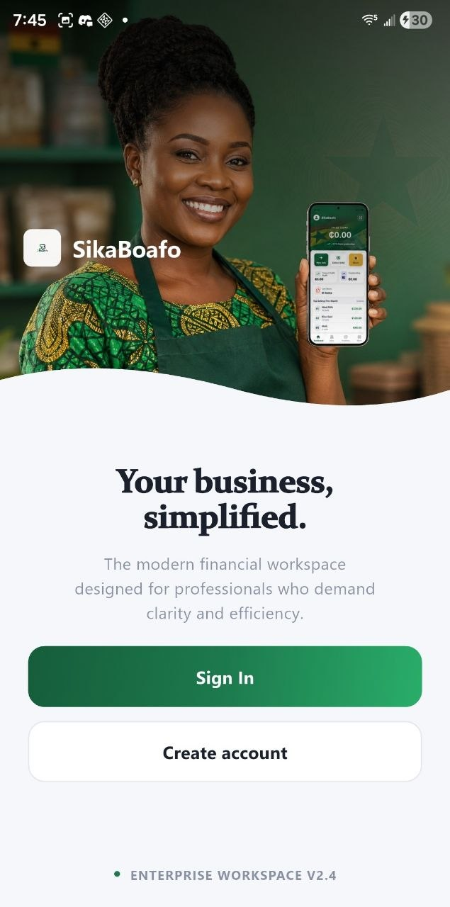
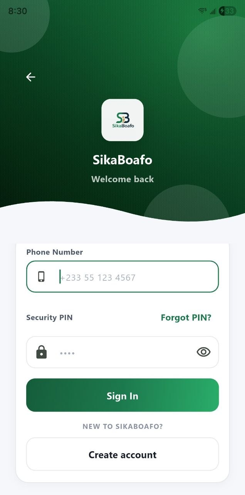
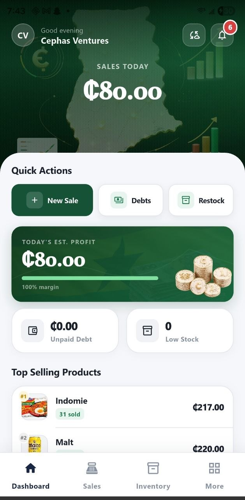
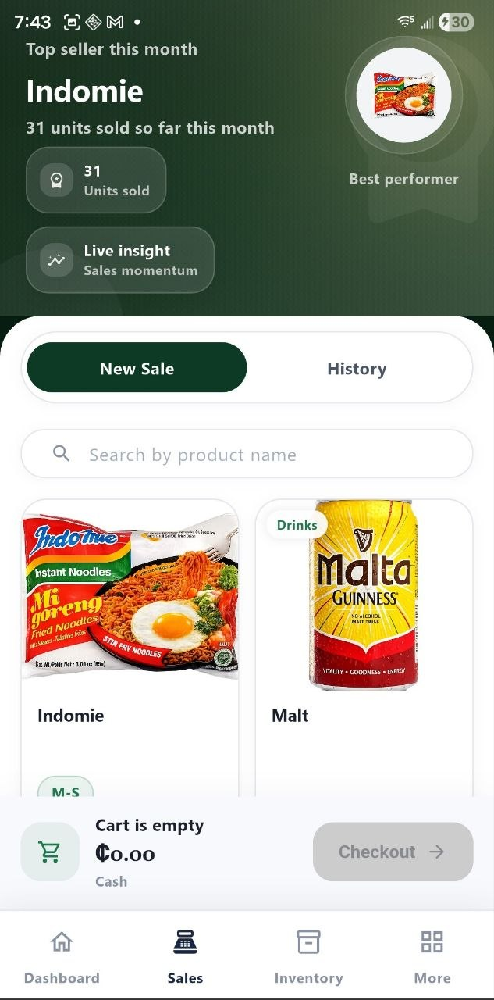
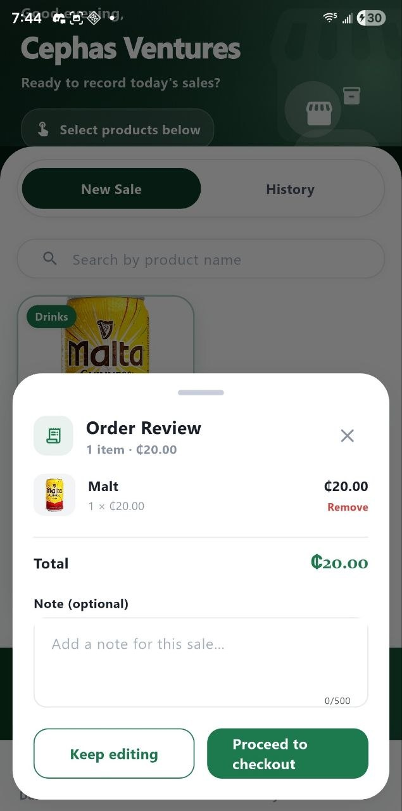
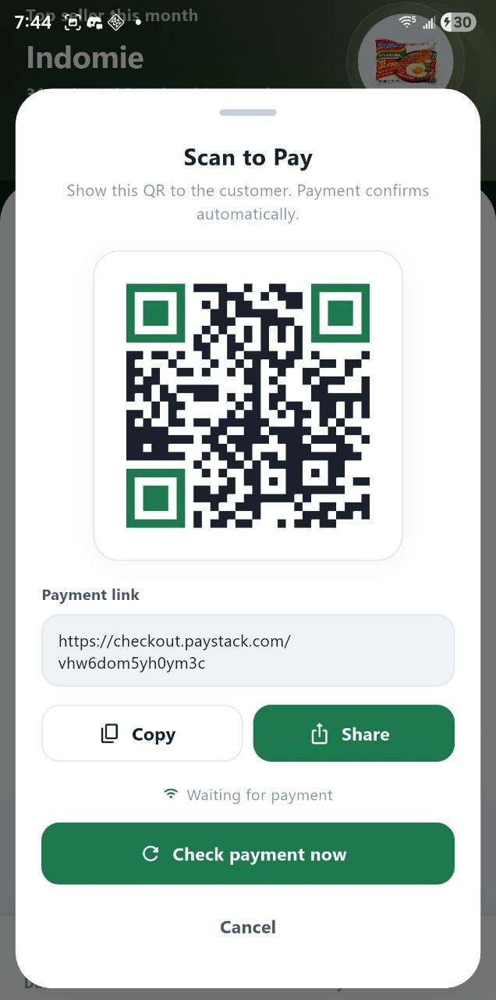
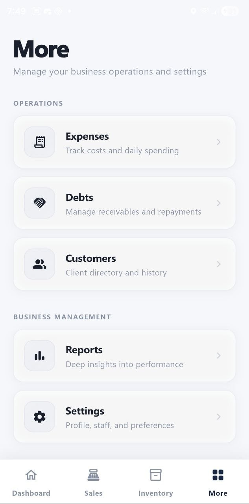

# SikaBoafo

**Merchant OS for Ghanaian microbusinesses — offline-first, built for daily operations.**

SikaBoafo replaces pen-and-paper bookkeeping with a structured mobile app. Merchants record sales, manage stock, track debts, log expenses, and collect payments digitally — even without internet. Everything syncs automatically when connectivity returns.

> **43 active test users** · Flutter + FastAPI + PostgreSQL · Paystack payments

---

## Navigation

- [Screenshots](#screenshots)
- [Features](#features)
- [Architecture](#architecture)
- [Getting Started](#getting-started)
- [Documentation](#documentation)
- [Status](#status)

---

## Screenshots

<table>
  <tr>
    <td align="center" width="33%">
      <br/>
      <b>Welcome</b><br/>
      <sub>Clean entry point with direct paths to Sign In or Create Account.</sub>
    </td>
    <td align="center" width="33%">
      <br/>
      <b>Sign In</b><br/>
      <sub>Phone number + PIN authentication with Forgot PIN recovery.</sub>
    </td>
    <td align="center" width="33%">
      <br/>
      <b>Dashboard</b><br/>
      <sub>Live KPIs — today's sales, estimated profit, unpaid debts, and low-stock alerts.</sub>
    </td>
  </tr>
  <tr>
    <td align="center" width="33%">
      <br/>
      <b>Sales</b><br/>
      <sub>Product catalog with variant chips, cart management, and one-tap checkout.</sub>
    </td>
    <td align="center" width="33%">
      <br/>
      <b>Checkout</b><br/>
      <sub>Order review with line items, total, and payment method selection.</sub>
    </td>
    <td align="center" width="33%">
      <br/>
      <b>Scan to Pay</b><br/>
      <sub>Live Paystack QR with shareable link and real-time confirmation.</sub>
    </td>
  </tr>
  <tr>
    <td align="center" colspan="3">
      <br/>
      <b>More</b><br/>
      <sub>Hub for Expenses, Debts, Customers, Reports, and Settings.</sub>
    </td>
  </tr>
</table>

---

## Features

| Module | What it does |
|---|---|
| **Dashboard** | Real-time KPI strip — sales today, profit, overdue debts, low-stock count, top sellers |
| **Sales** | POS with product variants, cart editing, Paystack QR and mobile-money checkout |
| **Inventory** | Stock tracking with low-stock alerts, movement history, and product image support |
| **Debts** | Receivables with due dates, payment links, automated reminders, and repayment history |
| **Expenses** | 7 expense categories with monthly summaries and category breakdowns |
| **Reports** | Daily / weekly / monthly revenue, top customers, top items, and payment method splits |

Additional: customer profiles, staff management, biometric + PIN security, push notifications, offline-first sync.

---

## Architecture

| Layer | Stack |
|---|---|
| Mobile | Flutter · Riverpod · GoRouter · SQLite (14 tables, offline-first) |
| Backend | FastAPI · PostgreSQL · Redis — 50 endpoints across 13 modules |
| Sync | Idempotent device-keyed queue — multi-device safe, no duplicate writes |
| Payments | Paystack QR · mobile money · payment links · webhook reconciliation |
| Infra | Render (backend) · AWS S3 (assets) |

The mobile app writes locally first via an idempotent sync queue keyed on `source_device_id + local_operation_id`. Operations are replayed to the backend when connectivity returns — duplicate replays are safely ignored.

---

## Getting Started

```bash
git clone https://github.com/CephasTechOrg/SikaBoafo.git
cd SikaBoafo
```

Full setup instructions (backend + mobile + local infrastructure):

→ [`docs/development/SETUP.md`](docs/development/SETUP.md)

USB reverse forwarding for physical Android device testing:

→ [`docs/development/USB_REVERSE_QUICK_START.md`](docs/development/USB_REVERSE_QUICK_START.md)

Dev tooling and bootstrap scripts:

→ [`scripts/`](scripts/)

---

## Documentation

| Path | Contents |
|---|---|
| [`ghana_sme_os_docs/`](ghana_sme_os_docs/) | Architecture, database schema, API contracts, Paystack integration, UI design |
| [`docs/development/`](docs/development/) | Setup guide, USB debugging, mobile backend debugging |
| [`docs/product/`](docs/product/) | AI strategy, feature roadmap |
| [`docs/auth/`](docs/auth/) | PIN + OTP flow design |
| [`scripts/`](scripts/) | Bootstrap and dev tooling |

---

## Status

Active development · M1–M3 complete and stable · Paystack integration live (QR, mobile money, payment links, webhook settlement) · 43 active test users in Ghana.
